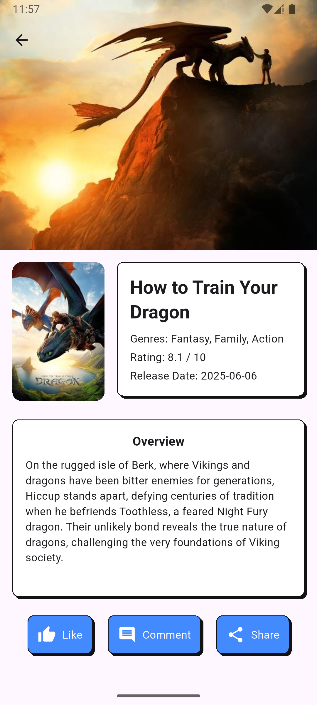

## 🎬 Neo Brutalism Movie App

A modern **Movie App** built with **Flutter**, using **GetX** for state management, designed with a **Neo-Brutalism** UI, and structured with **Clean Architecture**.


---

## ✨ Features

* 🎬 Browse popular movies
* 🔍 Search movie by title
* 🧱 Built with GetX for reactive & efficient state management
* 🧼 Follows Clean Architecture: Separation of concerns for better maintainability
* 🎨 Unique and bold Neo-Brutalism design
* ⚡ Fast performance and smooth UI transitions

---

## 📂 Project Structure

```
lib/
├── app/
│   ├── core/            # Core config, network, error, etc.
│   ├── data/            # Data sources, models, repositories (implements)
│   ├── domain/          # Entities, abstract repositories, usecases
│   ├── modules/         # Features (home, search, login, detail_item, etc.)
│   │   └── home/
│   │       ├── controllers/
│   │       ├── views/
│   │       └── bindings/
│   └── routes/          # GetX routing configuration
├── main.dart            # Entry point
```

This structure follows **Clean Architecture**:

| Layer       | Description                                                                 |
| ----------- | --------------------------------------------------------------------------- |
| **Data**    | Handles API, model parsing, local/remote data source                        |
| **Domain**  | Defines `Entity`, `UseCase`, and `Repository` abstraction                   |
| **Modules** | Feature-based folder with `controllers`, `views`, and `bindings` using GetX |
| **Core**    | Global config, shared utils, error handler, network setup, etc              |

---

## 🧪 Tech Stack

| Layer            | Technology Used                                          |
| ---------------- | -------------------------------------------------------- |
| **State Mgmt**   | [GetX](https://pub.dev/packages/get)                     |
| **Architecture** | Clean Architecture                                       |
| **Design**       | Neo-Brutalism (bold, flat UI)                            |
| **Data**         | [TMDB API](https://www.themoviedb.org/documentation/api) |

---

## 🚀 Getting Started

### 1. Clone the repository

```bash
git clone https://github.com/iZenrix/movie_project.git
cd movie_project
```

### 2. Install dependencies

```bash
flutter pub get
```

### 3. API Key
To use the TMDB API, you need to obtain an API key. Follow these steps:
1. Go to [TMDB API](https://www.themoviedb.org/documentation/api).
2. Sign up or log in.
3. Create a new API key.
4. Add your API key to the `.env` file in the root directory of the project.
5. Make sure to add the `.env` file to your `.gitignore` to keep it private.
6. Example `.env` file:
```
API_BASE_URL=https://api.themoviedb.org/3
API_KEY=your_api_key_here
```

### 4. Run the app

```bash
flutter run
```

### 5. Login
To access the app, you can use the following credentials:
```
Username: user@example.com
Password: yourpassword
```

---

## 📸 Screenshots

| Home Screen                   | Search Screen                    |
|------------------------------|----------------------------------|
|    |  |

| Login Screen                  | Detail Screen                    |
|------------------------------|----------------------------------|
|  |  |

---

## 🤝 Contributing

Pull requests are welcome. For major changes, please open an issue first to discuss what you'd like to change.

---

## 🔗 Connect

* [LinkedIn](https://linkedin.com/in/fajrulfalahsubakti)
* [Portfolio](https://fajrul-falah.vercel.app/)

---

